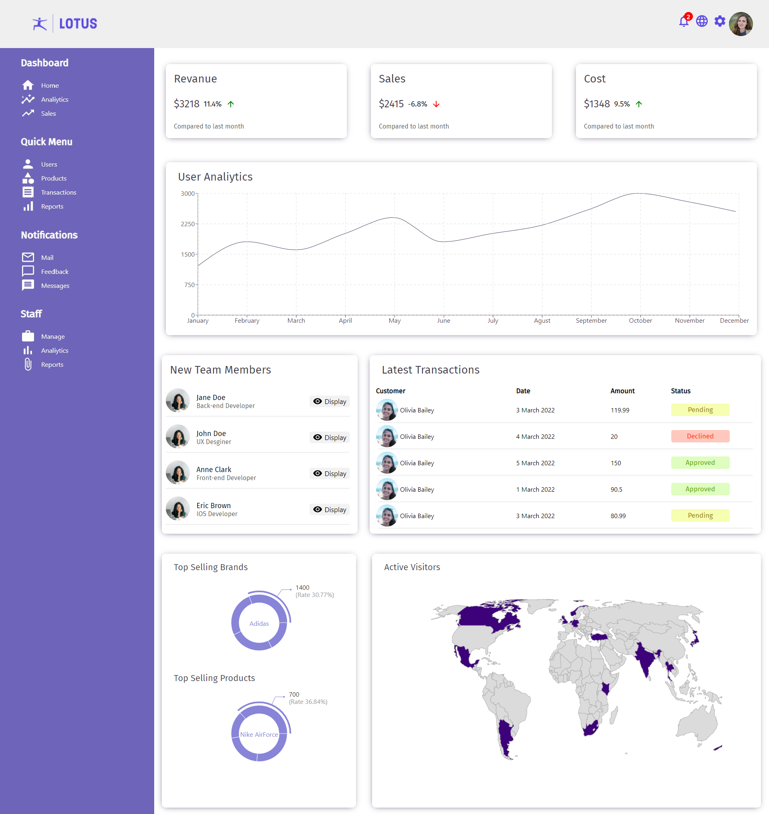
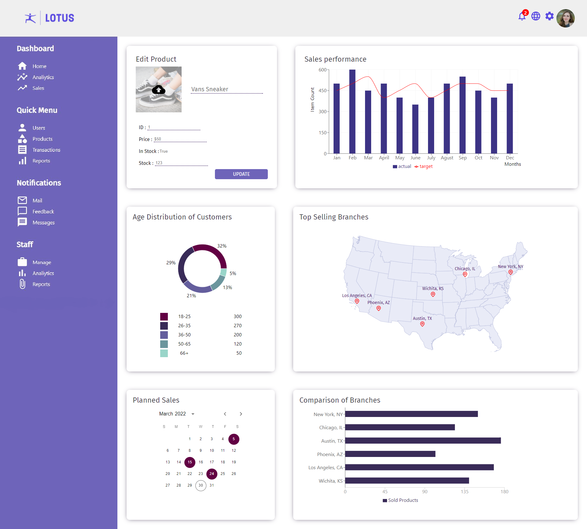
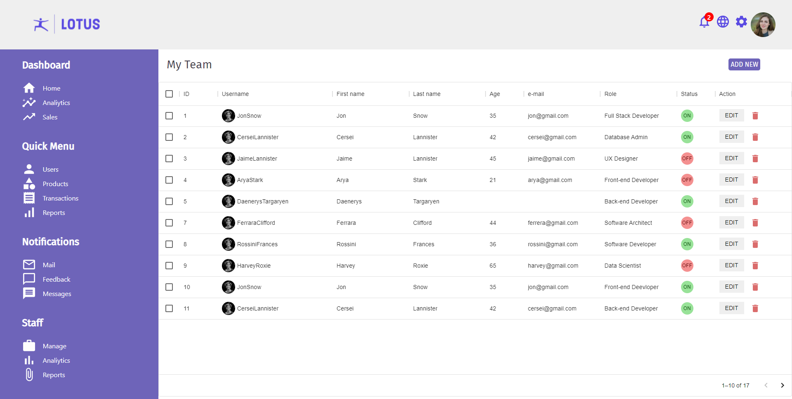
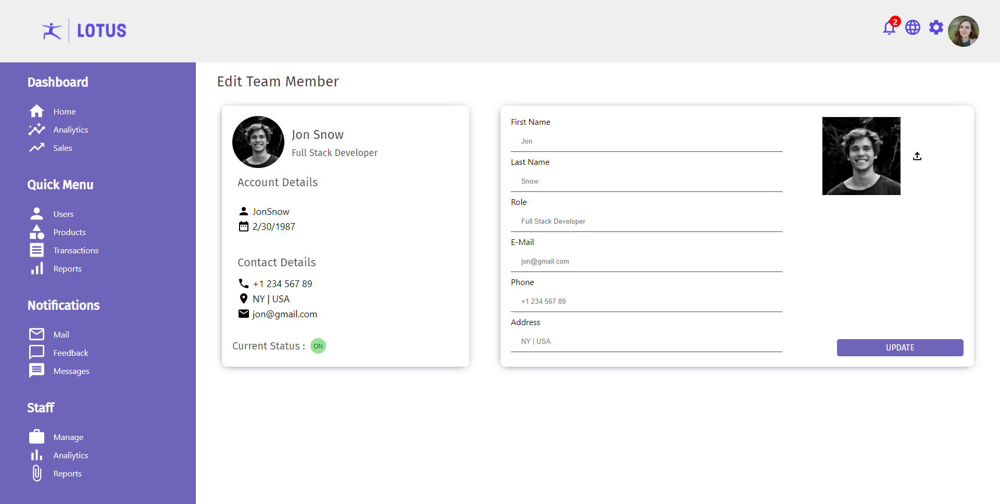

# Base Admin Dashboard

This is a front-end project developed with React for base admin dashboards.
React re-charts used for custom pie/bar and line charts. React-simple-maps used for displaying maps, and adding markers. CSS/Styled components/SASS used for styling. React-calendar used for custom calendar development and Material UI used for layout systems.

On Home Page User-Analiytics and Top Selling widgets developed with react-recharts.
Active visitorsa widget developed with react-simple-maps and colorized based on a geo-json.

On Single Product Page, admin can see current status of product.
Top Selling Branches widget developed with react-simple-maps and markers placed on cities based on their langitude and lattitude values.
Planned Sales widget is a customized calendar developed with react-calendar library.
Age Distribution widget and bar charts developed with re-charts.

On Team Page admin can see team members.
A dummy team members object array mapped for this page and based on key/value pairs components conditional rendered and placed into Material UI table.
By edit button on seperate page admin can see users information and edit them.

On Edit Team Member page, admin can see and edit team members current status.
